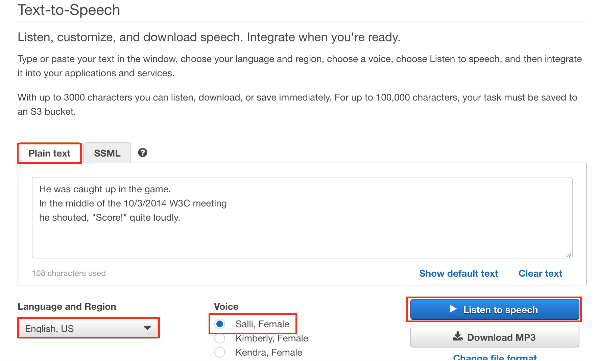
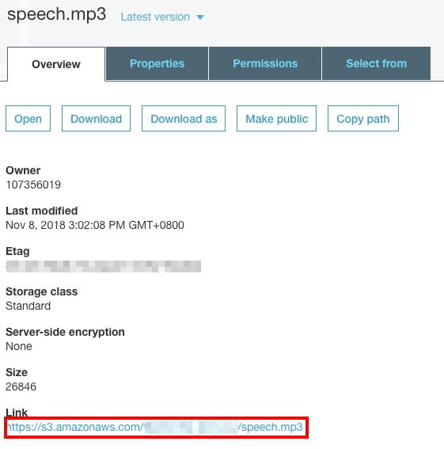
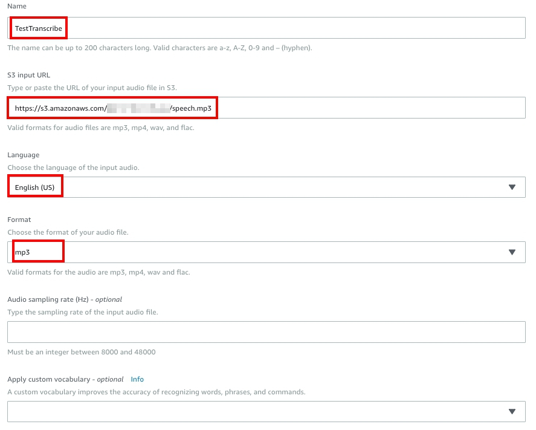
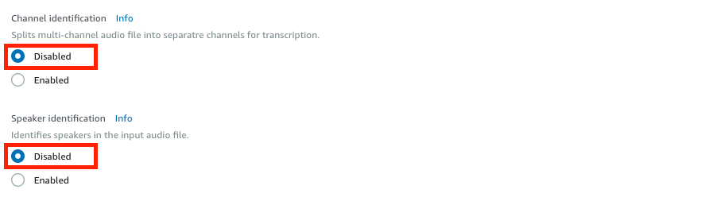
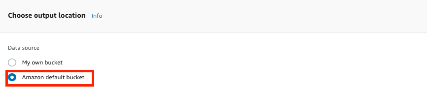
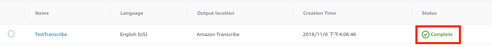
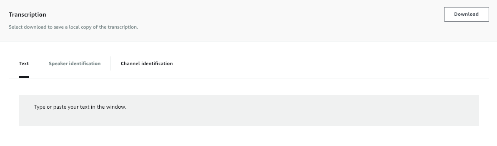
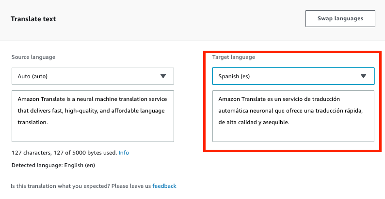
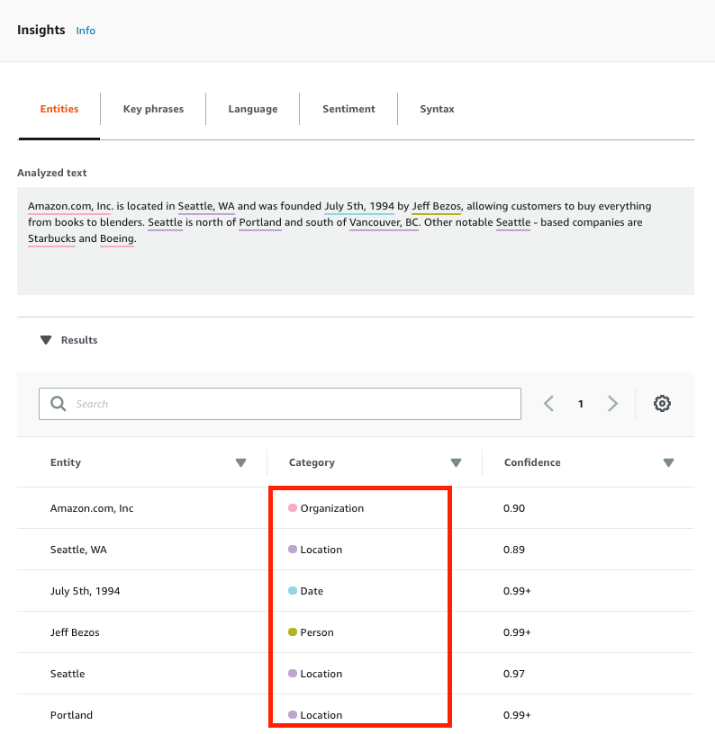

Getting Started with Amazon Polly, Transcribe, Translate and Comprehend
=================================================================
In this tutorial, we will show you how to get started with [Amazon Polly](https://aws.amazon.com/tw/polly/), [Amazon Transcribe](https://aws.amazon.com/tw/transcribe/), [Amazon Translate](https://aws.amazon.com/tw/translate/), [Amazon Comprehend](https://aws.amazon.com/tw/comprehend/) using AWS Console.

## Prerequisite
- Make sure the region is __US East (N. Virginia)__, which its short name is __us-east-1__.

## Lab tutorial
### Using Amazon Polly to turn text into lifelike Speech 

1. Sign in to the __AWS Management Console__, and then open __AWS Polly console__.

2. Choose the __Text-to-Speech__ tab.

3. Choose __Plain text__.

4. Type or paste this text into the input box.
```
He was caught up in the game. 
In the middle of the 10/3/2014 W3C meeting
he shouted, "Score!" quite loudly.
```

4. For Choose a __Language and Region__, choose __English US__, then choose the __Voice__ you want to use for this text.

5. To listen to the speech immediately, Click __Listen to speech__.



6. To save the speech to a file, do one of the following:
    - Choose __Download MP3__.
    > To change to a different file format, choose __Change file format__, choose the file format you want, and then choose __Change__.
    - You will get a file name __speech_TIMESTAMP.mp3__.
### Automatic Speech Recognition with Amazon Transcribe

1. Sign in to the __AWS Management Console__, and then open __AWS S3 console__.

2. Click __Create Bucket__.

3. For Bucket Name, type __Unique Name__.

4. For Region, choose __US East (N. Virginia)__, Click __Create__.

5. Select the bucket which you created before, and upload [speech.mp3](speech.mp3) to bucket.

6. Select __speech.mp3__ and note the __Link__.



7. On the __Service__ menu, click __Transcribe__.

8. Choose the __Transcription jobs__ tab.

9. Click __Create job__.

10. Enter the following information:
- Transcription job name : __TestTranscribe__
- Amazon S3 input URL : Paste the __link__ of __speech.mp3__
> The location must be in the same region as the endpoint that you are calling.
- Language : __English (US)__
- Format : __mp3__
- Channel identification : __Disabled__
- Speaker identification : __Disabled__




11. For __Choose output location__, choose __Amazon default bucket__.



12. Click __Create__ to submit the job for processing.

13. When processing is completed, you will see __Status__ change into __Completed__.



14. Click __TestTranscribe__ job, in the __Transcription__ section, you will
get the text transcribe from __speech1.mp3__.



### Language Translation with Amazon Translate

1. Sign in to the __AWS Management Console__, and then open __AWS Translate console__.

2. Choose the __Real-time translation__ tab.

3. For __Target language__, choose __Spanish (es)__.

4. Paste the following into the input box. The translated text appears in the right-hand text box.
    ```        
    Amazon Translate is a neural machine translation service that delivers fast, high-quality, and affordable language translation. 
    ```
    

### Natural Language Processing using Amazon Comprehend

1. Sign in to the __AWS Management Console__, and then open __AWS Comprehend console__.

2. Choose the __Real-time analysis__ tab.

3. Paste the following into the __Input text__.

4. Click __Analyze__.
```
Amazon.com, Inc. is located in Seattle, WA and was founded July 5th, 1994 by Jeff Bezos, allowing customers to buy everything from books to blenders. Seattle is north of Portland and south of Vancouver, BC. Other notable Seattle - based companies are Starbucks and Boeing.
```
5. In the __Insights__ section, the text is color-coded to indicate the __entity__ type of significant words:
- __Orange__ tags identify locations.
- __Brown__ tags identify dates.
- __Magenta__ tags identify persons.
- __Blue__ tags identify organizations.
- __Black__ tags identify other entities that don't fit into any of the other entity categories.



## Conclusion

Congratulations! We now have learned how to:
- Turns text into lifelike speech
- Analyze audio files and return a text file
- Translate text into different language
- Find insights and relationships in text 

## Clean Resources
To avoid excessive billing, please delete the following resources when you have finished your practice.
- Transcription jobs on Amazon Transcribe.
- The file you upload to S3.
## Ongoing:
- [Create a Chatbot and Configure with Intent and Slot type](../02-Build-an-Amazon-Lex-Bot/201-Create-a-Chatbot-and-Configure-with-Intent-and-Slot-type.md)
