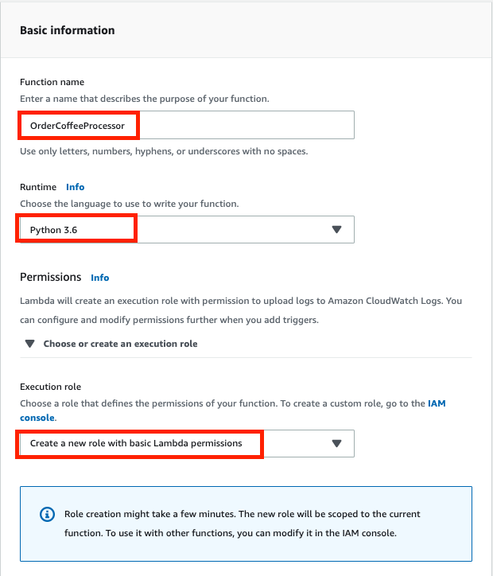
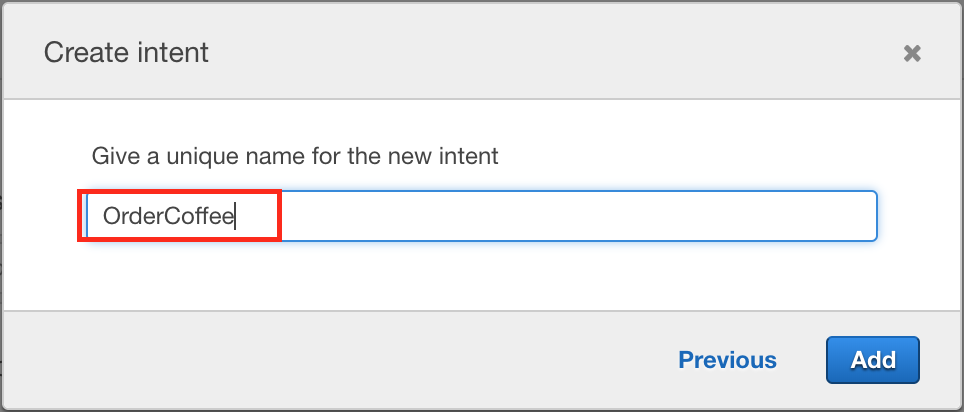
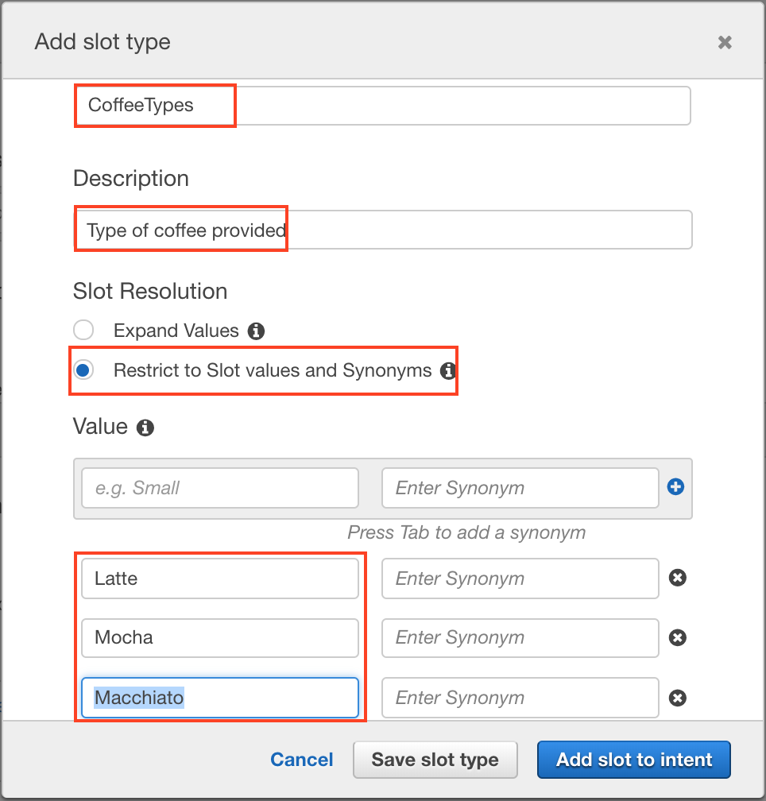
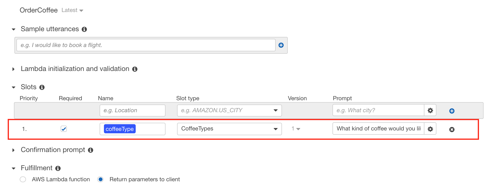
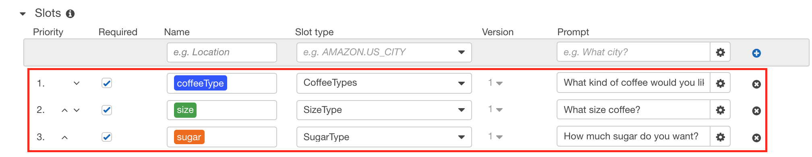
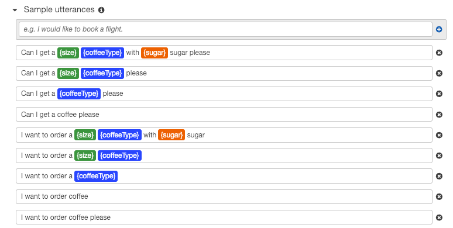
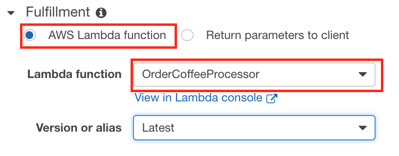
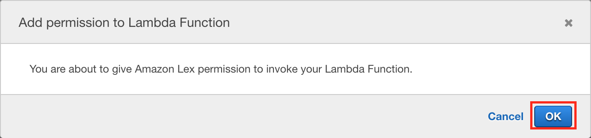
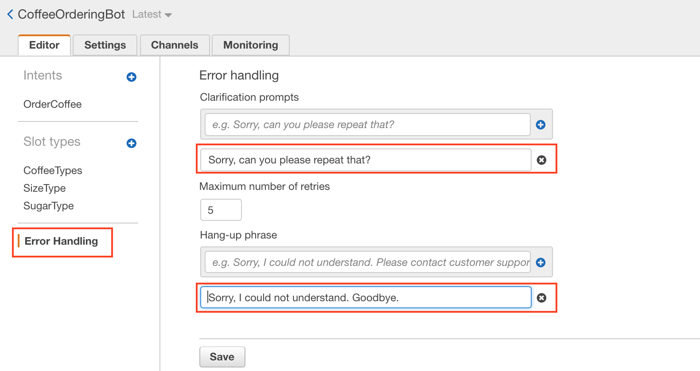
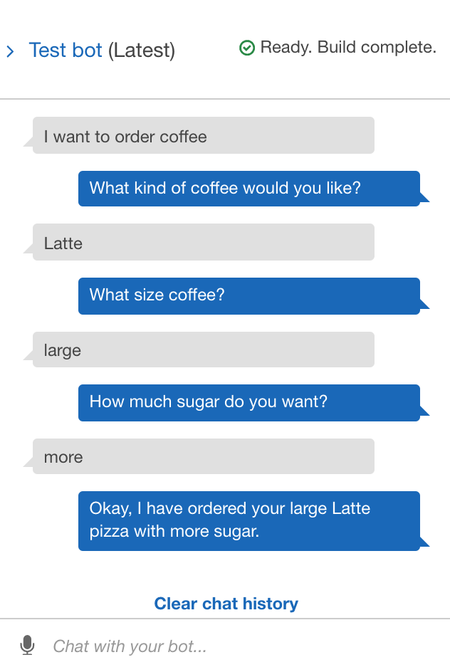

Create a Chatbot and Configure with Intent and Slot type
========================================================
[Amazon Lex](https://aws.amazon.com/tw/lex/) is a service for building conversational interfaces into any application using voice and text. Amazon Lex provides the advanced deep learning functionalities of automatic speech recognition (ASR) for converting speech to text, and natural language understanding (NLU) to recognize the intent of the text, to enable you to build applications with highly engaging user experiences and lifelike conversational interactions. 

## About this lab
### Scenario
This lab use [Amazon Lex](https://aws.amazon.com/tw/lex/) and [Amazon Lambda](https://aws.amazon.com/tw/lambda/) to create the Bot helping you to process orders.

## Prerequisites
  -  Make sure you are in __US East (N. Virginia)__, which short name is __us-east-1__.

## Lab tutorial
### Create a Lambda Function
1. On the __Service__ menu, click __Lambda__.

2. Click __Create function__.

3. Choose __Author from scratch__.

4. Enter the following information : 
- Name : __OrderCoffeeProcessor__
- Runtime : __Python 3.6__
- Execution role : __Create new role with basic Lambda permission__



5. Click __Create function__.

6. In the __Function code__ section, 
copy the following Python code and paste it in the window.
```
import json

def lambda_handler(event, context):
    # get slots value
    slots = event['currentIntent']['slots']
    coffeeType = slots['coffeeType']
    size = slots['size']
    sugar = slots['sugar']

    sess_attr = event['sessionAttributes']

    # bot response setting
    msg="Okay, I have ordered your {0} {1} with {2} sugar."
    msg = msg.format(size,coffeeType,sugar)

    return {
        'sessionAttributes': sess_attr,
        'dialogAction': {
            'type': 'Close',
            'fulfillmentState': 'Fulfilled',
            "message": {
            "contentType": "PlainText",
            "content": msg
            }
        }
    }
```

7. Choose __Save__.

### Build your First Chat Bot
1. On the __Service__ menu, click __Lex__.

2. Click __Create__.

3. Click __Custom bot__.

4. Enter following informations:
- Bot name : __CoffeeOrderingBot__
- Output voice : __Joanna__
- Session timeout : __5 min__
- COPPA : __Yes__

5. Click __Create__.

### Create an Intent
1. In the Amazon Lex console, choose the __plus sign (+)__ next to __Intents__.

2. Click __Create new intent__.

3. In the __Create intent__ dialog box, type the name of the intent __OrderCoffee__.

4. Choose __Add__.



### Create Slot Types 
1. In the left menu, choose the __plus sign (+)__ next to __Slot types__.

2. Click __Create slot type__.

3. In the __Add slot type__ dialog box, enter the following:
- Slot type name : __CoffeeTypes__
- Description : __Type of coffee provided__
- Slot Resolution : __Restrict to Slot values and Synonyms__

- Value : __Latte, Mocha, Macchiato__.



4. Click __Add slot to intent__.

5. In the __Slots__ section, choose __Required__. 

6. Change the name of the slot from __slotOne__ to __coffeeType__. 

7. Change the __prompt__ to __What kind of coffee would you like?__ .



8. Repeat __Step 1__ through __Step 7__ using the values in the following table:

    <table>
        <tbody>
        <tr>
            <th>Name</th>
            <th>Description</th>
            <th>Values</th>
            <th>Slot name</th>
            <th>Prompt</th>
        </tr>
        <tr>
            <td>size</td>
            <td>Available sizes</td>
            <td>small, medium, large</td>
            <td>SizeType</td>
            <td>What size coffee?</td>
        </tr>
        <tr>
            <td>sugar</td>
            <td>How much Sugar</td>
            <td>less, half, more</td>
            <td>SugarType</td>
            <td>How much sugar do you want?</td>
        </tr>
        </tbody>
    </table>



### Configure the Intent

1. In the __Sample utterances__ filed, enter the follow strings, then click the __plus sign (+)__.
    - I want to order coffee please
    - I want to order coffee
    - I want to order a {coffeeType}
    - I want to order a {size} {coffeeType}
    - I want to order a {size} {coffeeType} with {sugar} sugar
    - Can I get a coffee please
    - Can I get a {coffeeType} please
    - Can I get a {size} {coffeeType} please
    - Can I get a {size} {coffeeType} with {sugar} sugar please



2. At the __Fulfillment__ Part, choose __AWS Lambda function__.

3. Choose __OrderCoffeeProcessor__.



> Note : If the __Add permission to Lambda function__ dialog box is shown, choose __OK__ to give the OrderCoffee intent permission to call the OrderCoffeeProcessor Lambda function.



4. Click __Save Intent__.

### Configure error handling for the bot
1. On __Editor__ tab. and then choose __Error Handling__.

2. In the __Clarification prompts__ filed, enter the __Sorry, can you please repeat that?__.

3. click the __plus sign (+)__.

4. In the __Hang-up__ filed, enter the __Sorry, I could not understand. Goodbye.__.

5. click the __plus sign (+)__.

6. click __Save__.



### Build and Test the Bot
1. To build the __CoffeeOrderingBot__
 bot, choose __Build__.

2. To test the bot, in the __Test bot__ window, start communicating with your Amazon Lex bot.



## Conclusion
Congratulations! We now have learned how to:
- Setup the bot.
- Integrate Amazon Lambda with Amazon Lex.

## Next Level
- [Integrating an Amazon Lex Bot wit Facebook Messenger](../02-Build-an-Amazon-Lex-Bot/202-Integrating-an-Amazon-Lex-Bot-with-Facebook-Messenger.md)
