Integrating an Amazon Lex Bot with Facebook Messenger
=============================================

## About this lab
### Scenario
This lab use [Amazon Lex](https://aws.amazon.com/tw/lex/) deploy the bot to Facebook Messenger. We will instruct you to sign up [Facebook Developer Account](https://developers.facebook.com/) and create your Facebook Page to fulfill coffee order bot.

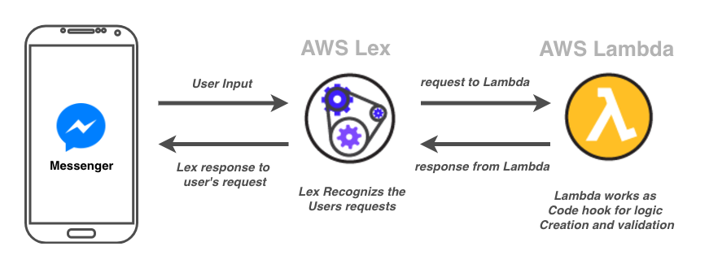

## Prerequisites
  -  Make sure you are in __US East (N. Virginia)__, which short name is __us-east-1__.
  - Fulfill previous tutorial : [Create a Chatbot and Configure with Intent and Slot type](../02-Build-an-Amazon-Lex-Bot/201-Create-a-Chatbot-and-Configure-with-Intent-and-Slot-type.md)
  - Already registered __Facebook Account__

## Lab tutorial
### Create a Facebook Page
1. Log in your Facebook Account, click __Create a Page__ in the top right hand corner. 

    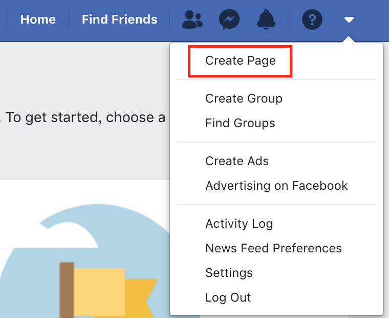

2. Choose __Business or Brand__, and then click __Get Started__.

    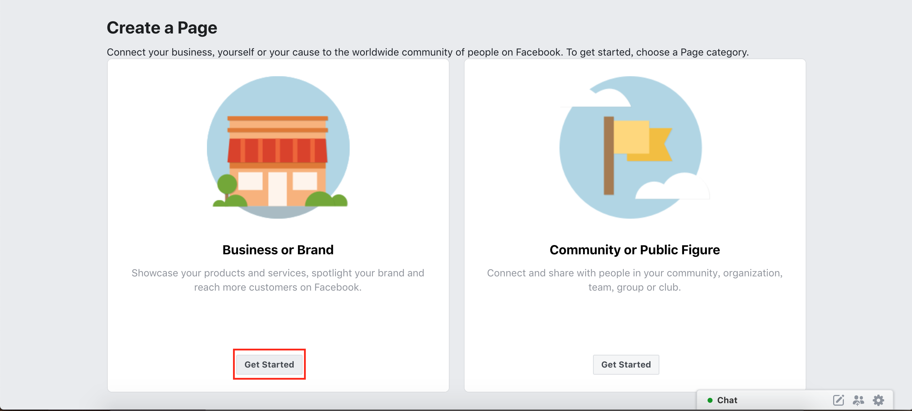

3. In the __Page Name__ dialog box, type the __Test-OrderCoffeeBot__.

    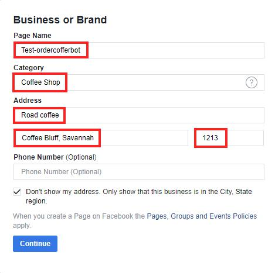

4. Click __Continue__.

5. In __Add a Profile Picture__ Part, click __Skip__.

6. In __Add a Cover Photo__ Part, click __Skip__.

7. In the Page, click __Add a Button__ and choose __Contact you__.

8. Click __Send Message__.

    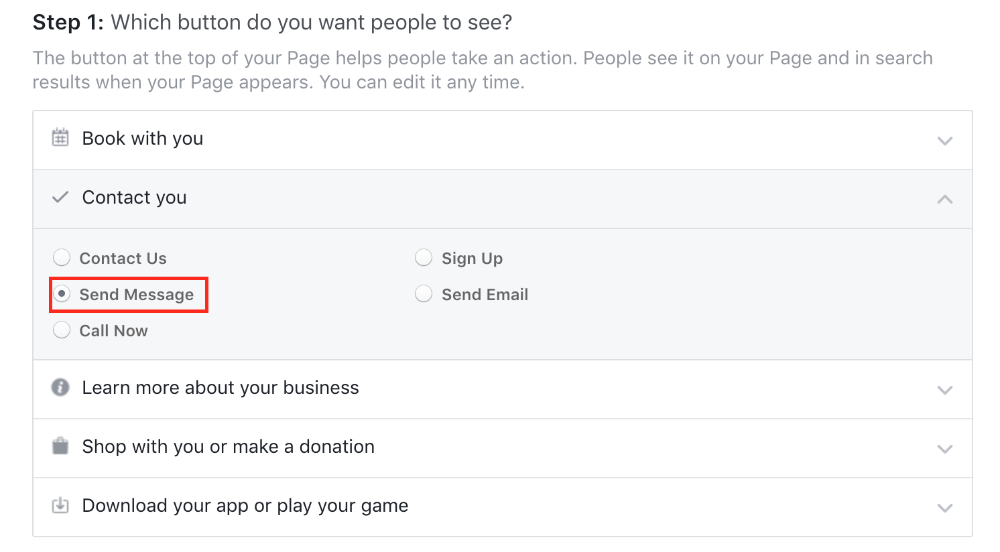

9. Click __Next__ Button.

10. Choose __Messenger__.

    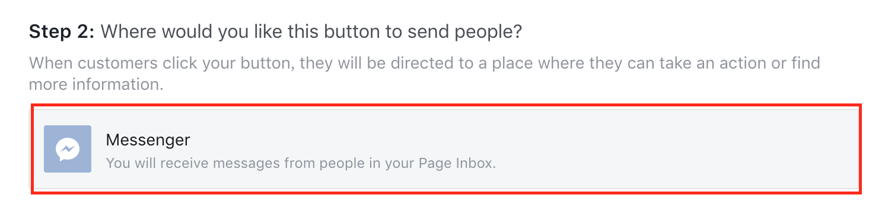

11. Click __Finish__.

### Sign up Facebook for Developers
1. Paste the url to your browser.
```    
https://developers.facebook.com/
```

2. On the top bar, click __Get Started__ 

3. In the Welcome to Facebook for Developers page, click __Next__.

4. Enter the following information:
- App Name : __CoffeeBot__ 
- Contact Email : your email

    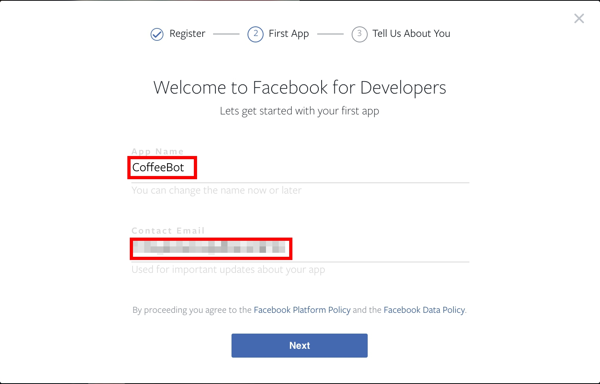

5. Click __Next__.

6. Click __Add your First Product__.

7. In the dashboard, choose __Messenger__ and click __Set Up__.

    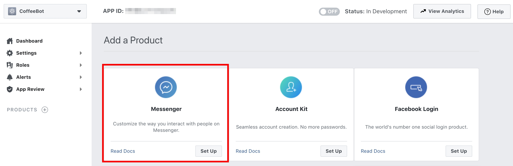

8. At __Token Generation__ section, select the page you just created, and it will generate the token.

    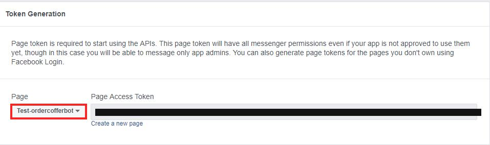

9. Note the __Page Access Token__ and we will use it later.

10. Click __Settings__ in the left navigator, and choose __Basic__.

11. Click __Show__ to get __App Secret__.

12. Note the __App ID__ and __App Secret__.

    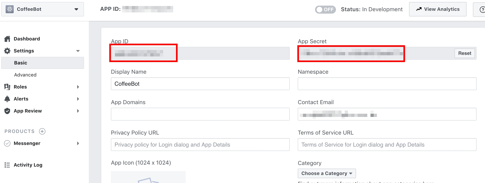

### Integrating Lex with FB Messenger

1. Sign in __AWS Console__, on the __Service__ menu, click __Lex__.

2. Choose __CoffeeOrderingBot__.

3. Click __Publish__ on the top.

4. In the __Publish CoffeeOrderingBot__ dialog box, enter __CoffeeBot__ for __Create an alias__ filed.

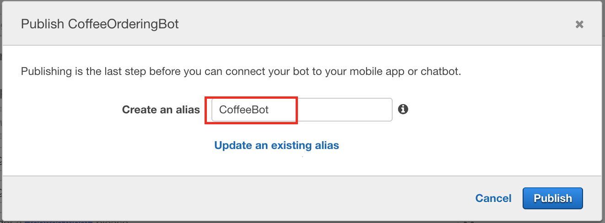

5. Click __Publish__.

6. Click  __Go to channels__.

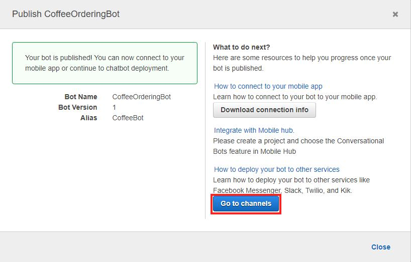

7. Enter the following string :
- Channel Name : __CoffeeBotForMessenger__
- Channel Description : __Deploy the bot to FB Messenger__
- KMS Key : choose __aws/lex__
- Alias : choose __CoffeeBot__
- Verify Token : __botToken__
- Page Access Token : paste __Page Access Token__  
- App Secret Key :  paste __App Secret__  

    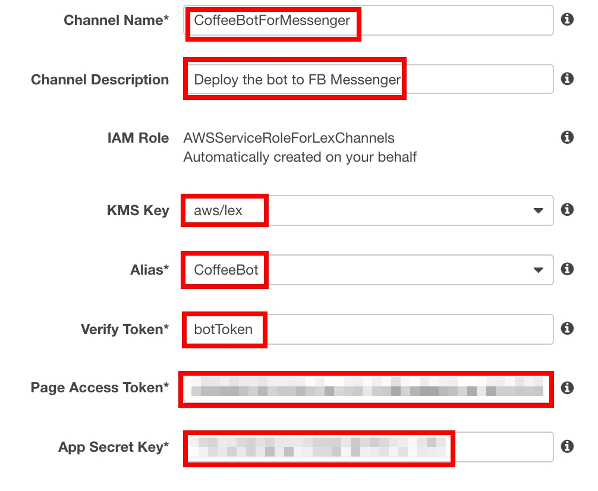

8. Click __Activate__.

9. In the __Callback URLs__ part, copy the __Endpoint URL__.

10. Back to the fb developer page, on the __Messenger__ tab, click __Settings__.

11. On the __Webhooks__ part, click __Setup Webhooks__.

12. Enter the following informations :
- Callback URL : the Endpoint URL you copy
- Verify Token : __botToken__.

13. Choose __Subscription Fields__ (__messages__, __messaging_postbacks__, and __messaging_optins__).

14. Click __Verify and Save__.

    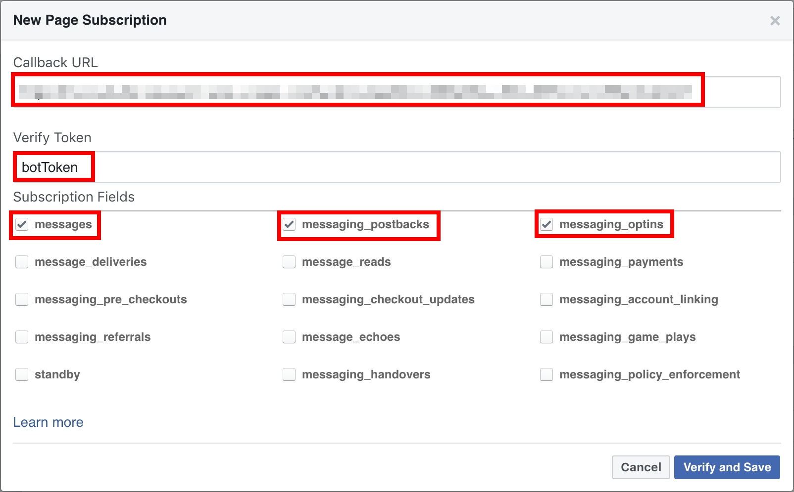

15. Select the page you created before, and click __Subscribe__.

    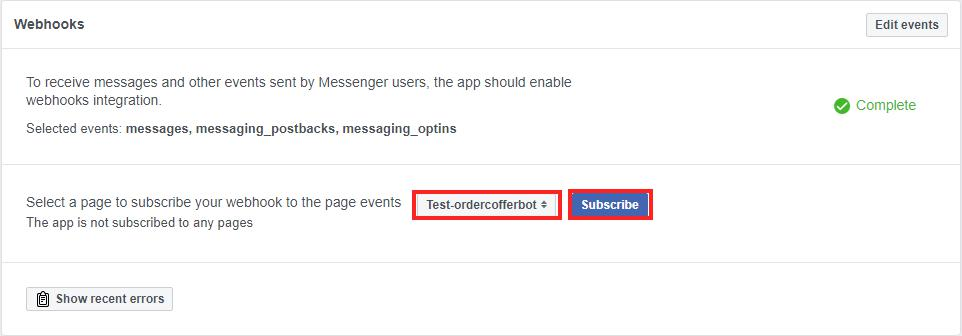

### Test your Chatbot On Messenger 
1. Open your Messenger on smartphone and chat with it.

    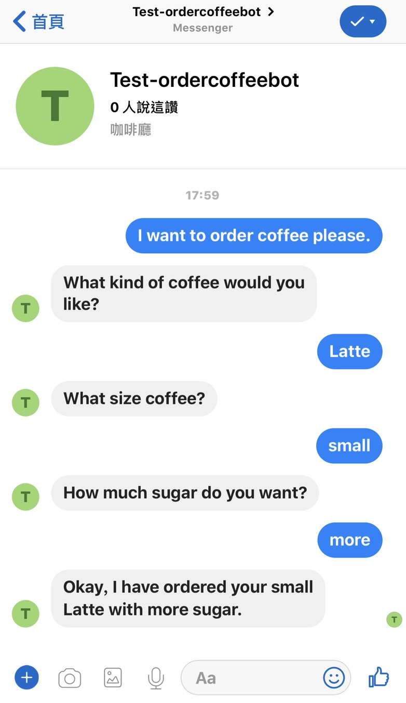

## Conclusion
Congratulations! We now have learned how to:
- How to create Facebook Page.
- Deploy your Lex bot to Facebook Messenger.

## Clean Resources
To avoid excessive billing, please delete the following resources when you have finished your practice.
- The bot in Amazon Lex

## Ongoing
- [Create Customize Face Collection with Rekognition](../03-Integrating-Amazon-Rekognition-into-Applications/301-Create-Customize-Face-Collection-with-Rekognition.md)