Create Customize Face Collection with Rekognition
==============================================

[Amazon Rekognition](https://aws.amazon.com/tw/rekognition/) makes it easy to add image and video analysis to your applications. You just provide an image or video to the Rekognition API, and the service can identify the objects, people, text, scenes, and activities, as well as detect any inappropriate content. Amazon Rekognition also provides highly accurate facial analysis and facial recognition on images and video that you provide. You can detect, analyze, and compare faces for a wide variety of user verification, people counting, and public safety use cases.

## About this lab
### Scenario
This lab use [Amazon Rekognition](https://aws.amazon.com/tw/rekognition/) to build your own face collection service by combining the capabilities of Amazon Rekognition and other AWS services, like AWS Lambda.This enables you to build a solution to create, maintain, and query your own collections of faces, be it for the automated detection of people within an image library, building access control, or any other use case you can think of.

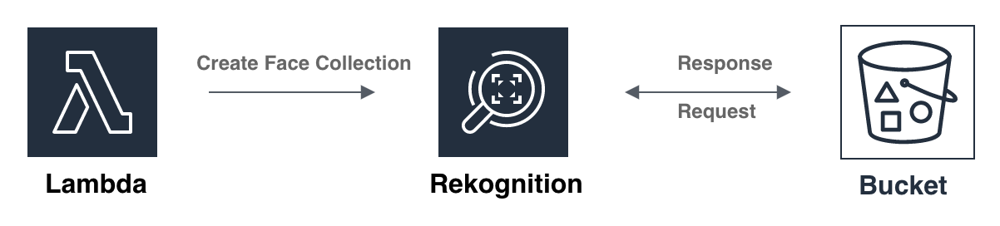

## Prerequisites
  -  Make sure you are in __US East (N. Virginia)__, which short name is __us-east-1__.

## Lab tutorial
### Upload the image for the Face Collection
Create a S3 Bucket that can be store face images for identfy.

1. On the __Service__ menu, click __S3__, Click __Create Bucket__.

2. For Bucket Name, type __Unique Name__.

3. For Region, choose __US East (N. Virginia)__, Click __Create__.

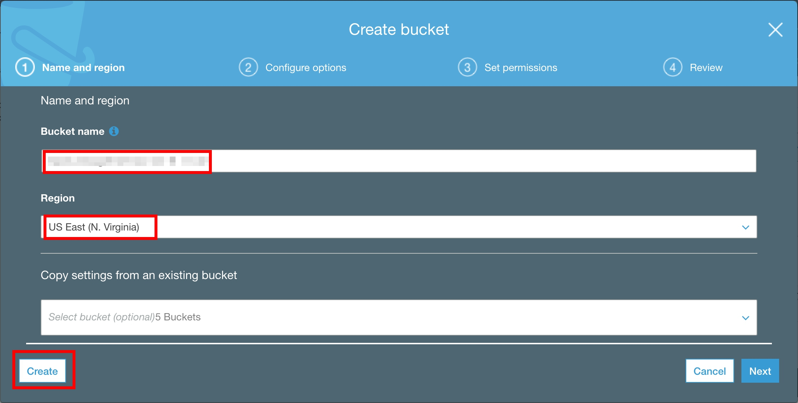

4. Select the bucket which you created before, and Upload __Cristine__ Folder.

## Create an IAM Role to Execute Lambda
1. On the __Services__ menu, click __IAM__.

2. Create __Roles__, and choose __Create Role__.

3. In __Select type of trusted entity__, select __AWS services__.

4. In __Choose the service that will use this role__, choose __Lambda__ and click __Lambda__.

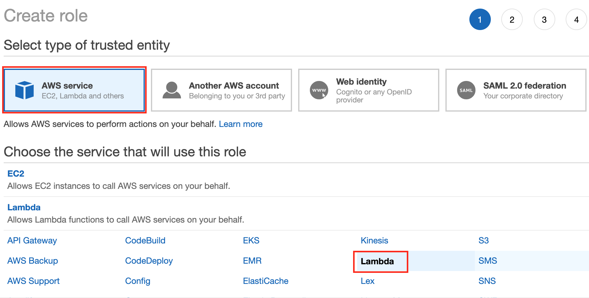

5. Click __Next:Permissions__.

6. In __Attach permissions policies__ page, select __CloudWatchFullAccess, AmazonS3FullAccess, AmazonRekognitionFullAccess__.
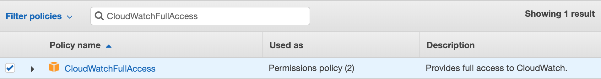
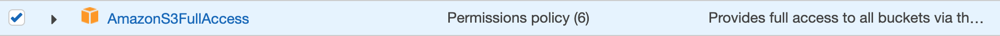

7. Click __Next:Tags__.

8. CLick __Next:Review__.

9. In the __Review__ page, enter the following information : 
    - __Role name__ : `BuildFaceCollection`
    - __Role description__ : `Allows Lambda functions to call S3 and Rekognition Services.`

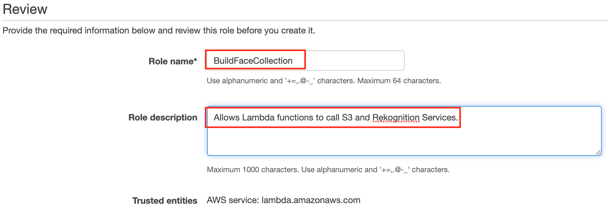

10. CLick __Create role__.

## Build your own Customize Face Collection
Create a Lambda function to build face collection and index the faces of our existing image.
1. On the __Services__ menu, click __Lambda__.

2. Click __Create function__.

3. Choose __Author from scratch__.

4. Enter the following information : 
- __Name__ : `build_face_collection_yourname` (e.g: jerry)
- __Runtime__ : Select __Python 3.6__
- __Permissions__ : 
  - Execution role : Choose __Use an existing role__.
  - Existing role : Select __BuildFaceCollection__ .

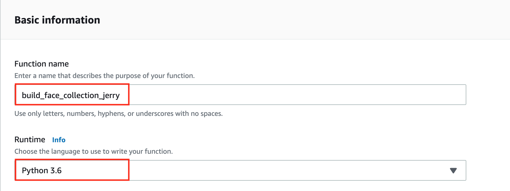
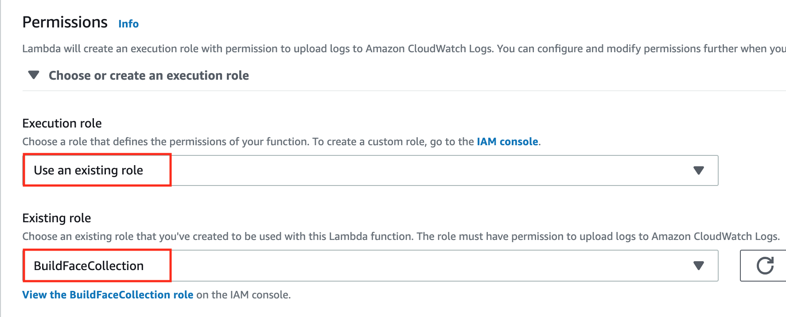

5. click __Create Function__.
   
6.   After creating the lambda function, copy the [build-face-collection.py](build-face-collection.py) code and paste into the Lambda code field, then __Save__.

7.  Replace the following parameter in [build-face-collection.py](build-face-collection.py):
- __bucket_name__ : your bucket name created before
- __collection_name__ : `my-collection`

8.  Change __Basic settings__ and set __Timeout__ to __5 min__.

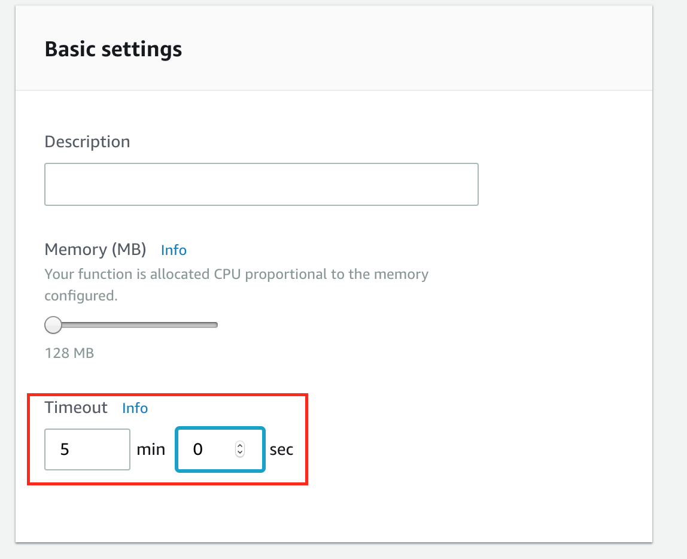
9. Click __Test__ button on the top.

10. Type __Exec__ as __Event name__.

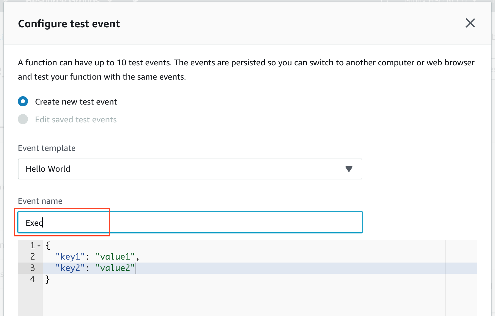

11. Click __Create__.

12. Then you click __Test__ again.

13. You will see the success message like this.

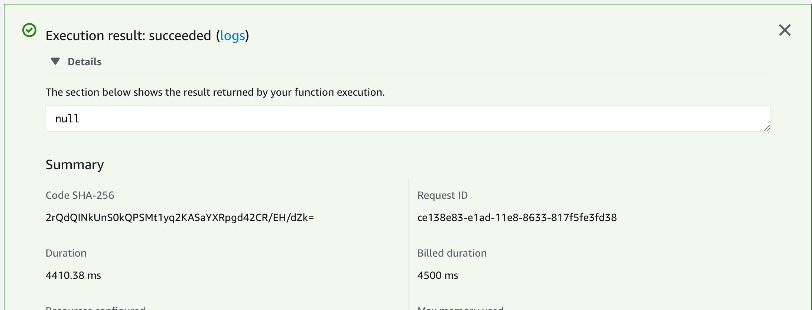

## Conclusion
Congratulations! You now have learned how to:
- Build your own face collection.

## Next Level:
- [Build a Serverless Facial Detect Application with AWS Lambda](../03-Integrating-Amazon-Rekognition-into-Applications/302-Build-a-Serverless-Facial-Detect-Application-with-AWS-Lambda.md)