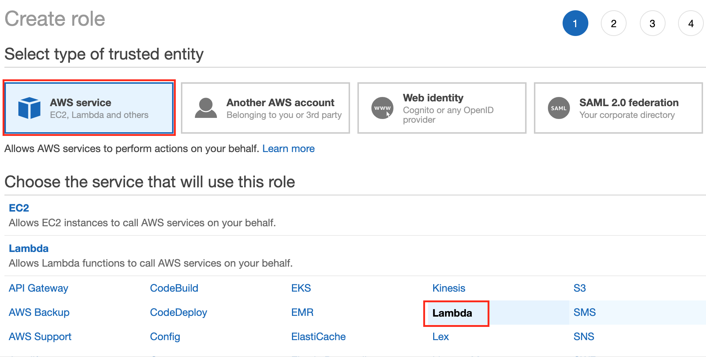
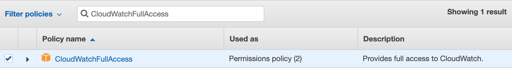
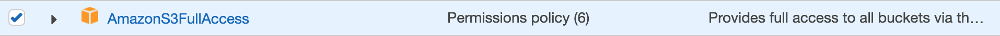
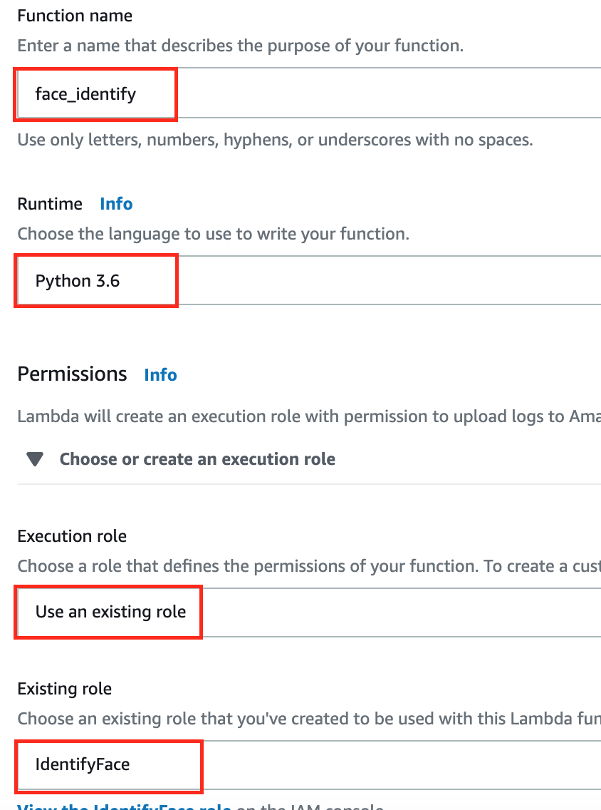

Build a Serverless Facial Detect Application with AWS Lambda
============================================================

## About this lab
### Scenario
 In this lab, you will host a static facial detecting website in [Amazon S3](https://aws.amazon.com/tw/s3/), and build public backend API using [Lambda](https://aws.amazon.com/tw/lambda/) and [API Gateway](https://aws.amazon.com/tw/api-gateway/) to receives data that identify a person in photo with [Amazon Rekognition](https://aws.amazon.com/tw/rekognition/).


## Prerequisites
  -  Make sure you are in __US East (N. Virginia)__, which short name is __us-east-1__.
  -  Download __index.html__ which is in this repository.
  - Complete Lab : [Create Customize Face Collection with Rekognition](../03-Integrating-Amazon-Rekognition-into-Applications/301-Create-Customize-Face-Collection-with-Rekognition.md)

## Lab tutorial
### Create S3 bucket to store image
1. On the service menu, click __S3__.

2. Click __Create Bucket__.

3. For Bucket Name, type a __Unique Name__.

4. For Region, choose __US East(N.Virginia)__.

5. Click __Create__.


6. Click the bucket you just created.

7. On the __Permissions__ Tab, choose __Public Acesses settings__ and click __Edit__.

8. __Disable__ the following options.


9. Click __Save__.

10. Type ```confirm``` in the field for edit public access settings for this bucket, click __Confirm__.


11. On the __Permissions__ Tab, click __CORS configuration__ .


12. Paste the following code to editor.
     
```
<?xml version="1.0" encoding="UTF-8"?>
<CORSConfiguration xmlns="http://s3.amazonaws.com/doc/2006-03-01/">
<CORSRule>
    <AllowedOrigin>*</AllowedOrigin>
    <AllowedMethod>GET</AllowedMethod>
    <AllowedMethod>PUT</AllowedMethod>
    <AllowedHeader>*</AllowedHeader>
</CORSRule>
</CORSConfiguration>
```

13. Click __Save__.

14. Note your bucket name and replace **`your bucket name`** with it at __index.html__  line 210.


### Creating an Identity Pool

1. On the service menu, click __Cognito__.

2. Choose __Manage Identity Pools__.

3. Choose __Create new identity pool__.

4. In the __Identity pool name__ filed, type __rekognition web__.

5. Select __Enable access to unauthenticated identities__ from the __Unauthenticated identities__ collapsible section.


6. Click __Create Pool__.

7. Click __View Details__ to check IAM Role data.

8. In the __Unauthenticated Role__, Click __View Policy Document__.


9. Click __Edit__ and it will show dialog to check edit policy, choose __Ok__.


- Paste the following policy to editor, replaced **`<your-bucket-name>`** with the bucket name you create to store image.
```
{
    "Version": "2012-10-17",
    "Statement": [
        {
            "Effect": "Allow",
            "Action": [
                "mobileanalytics:PutEvents",
                "cognito-sync:*",
                "lex:*",
                "polly:*",
                "iot:*",
                "sumerian:*",
                "rekognition:*",
                "cognito-identity:*"
            ],
            "Resource": [
                "*"
            ]
        },
        {
            "Effect": "Allow",
            "Action": [
                "s3:PutObject",
                "s3:PutObjectAcl"
            ],
            "Resource": [
                "arn:aws:s3:::<your-bucket-name>",
                "arn:aws:s3:::<your-bucket-name>/*"
            ]
        }
    ]
}
```
10. Click __Allow__.

11. On the reight navigation bar choose __Sample code__.

12. Select JavaScript from the __Platform__ section.

13. Copy the sample code below __Get AWS Credentials__ section.


14. Paste the __Amazon Cognito credentials__ to __index.html__ line 135 to line 137.


### Create a S3 Bucket to Host static website

1. On the service menu, click __S3__.

2. Click __Create Bucket__.

3. For Bucket Name, type a __Unique Name__.

4. For Region, choose __US East(N.Virginia)__.

5. Click __Create__.


6. On the __Permissions__ Tab, choose __Public Acesses settings__ and click __Edit__.

7. Disable the following options.


8. Click __Save__.

9. Type __confirm__ in the field for edit public access settings for this bucket, click __Confirm__.


10. On the __Permissions__ Tab, click __Bucket policy__ .


- Paste the following code and replaced **`<your-bucket-name>`** with your bucket name to host web.
```
{
    "Version": "2012-10-17",
    "Statement": [
        {
            "Sid": "PublicReadGetObject",
            "Effect": "Allow",
            "Principal": "*",
            "Action": "s3:GetObject",
            "Resource": "arn:aws:s3:::<your-bucket-name>/*"
        }
    ]
}
```
11. Click __Save__.

12. Download the __index.html__ file in this Github repository first then click __Uplaod__ and __Add files__.

13. Select and add the __index.html__ file which you downloaded.

14. Click __Upload__ button on lower left side without any setting.

### Enable Static website hosting through S3

1. Select __Properties__ tab.

2. Click __Static website hosting__.

3. Select __Use this bucket to host a website__.

4.  Type __index.html__ for the index document and click __Save__.


5. Click the __Endpoint__ on the top of window.

6. You will see the website as below.


### Create an IAM Role For Lambda
1. On the __Services__ menu, click __IAM__.

2. Create __Roles__, and choose __Create Role__.

3. In __Select type of trusted entity__, select __AWS services__.

4. In __Choose the service that will use this role__, choose __Lambda__ and click __Lambda__.



5. Click __Next:Permissions__.

6. In __Attach permissions policies__ page, select __CloudWatchFullAccess, AmazonS3FullAccess, AmazonRekognitionFullAccess, AWSIoTFullAccess, TranslateFullAccess__.




7. Click __Next:Tags__.

8. CLick __Next:Review__.

9. In the __Review__ page, enter the following information : 
    - __Role name__ : `IdentifyFace`
    - __Role description__ : `Allows Lambda functions to use S3, Rekognition, IoT and Translate Services.`


10. CLick __Create role__.

### Build a Lambda Function to identify face

1. On the service menu, click __Lambda__.

2. Click __Create function__.

3. Choose __Author from scratch__.

- Enter the following information :
  - Name : __face_identify__
  - Runtime : __Python 3.6__
  - Execution role
 : __Use an existing role__
  - Existing role : Select __IdentifyFace__



4. Click __Create Function__.

- After creating the lambda function, copy the following code and paste into the Lambda code field, then replace **`<your face collection name>`** with `my-collection`.
```
import json
import boto3
rekognition_client = boto3.client('rekognition')

def lambda_handler(event, context):
    
    response = rekognition_client.search_faces_by_image(
        CollectionId='<your face collection id>',
        Image={
            'S3Object': {
                'Bucket': event['Bucket'],
                'Name': event['ObjectName'],
            
            }
        },
        MaxFaces=2,
        FaceMatchThreshold=60
    )
    
    if len(response['FaceMatches']) == 0:
        print("No Matches!")
        rekognition_face = "This face is not in collection"
    else :
        rekognition_face = str(response['FaceMatches'][0]['Face']['ExternalImageId'])
        print("Rekognition result:"+rekognition_face)
    
    return (rekognition_face)
```
5. Click __Save__.

### Set up API Gateway
1. On the service menu, click __API Gateway__.

2. Click __Get Started__ or __Create API__.

3. Select __New API__.

4. Type-in API name with __Serverless-rekognition-web__, then click __Create API__.


5. In the __Resources__ tab, choose the root __/__, click __Actions__ and select __Create Resource__.

6. Type __get-identify-result__ in the __Resource Name__.

7. Make sure __Enable API Gateway CORS is enabled__, then click __Create Resource__.


8. After resource being created, click __Actions__ and select __Create Method__ to add method.

9. In the drop-down list, select __POST__ method and click __yes__.

10. In the setup page as below:

  - Integration type : Select __Lambda Function__  
  - Lambda Region : Choose __us-east-1__  
  - Lambda function : Type the  __face_identify__ created in previous chapter in the Lambda Function


11. Click __Save__.

12. Click __OK__ to give API Gateway permission to invoke Lambda function.

13. Click __Actions__ within Resource layer, and select __Enable CORS__.

14. Click __Enable CORS and replace existing CORS headers__.

15. Review and click __Yes, replace existing values__.

- Waiting for the steps all be checked.


### Deploy APIs
1. Click __Actions__ and select __Deploy API__.

2. In the prompt console,
  - Deployment stage : Select __[New Stage]__ 
  - Stage name : __prod__


3. Click __Deploy__.

4. The console would jump out as below, select the __SDK Generation__ tab.

5. In the __SDK Generation__ tab, select __JavaScript__ in the Platform field and click __Generate SDK__.

6. The browser would ask you to confirm download a zip file named as __javascript_TIMESTAMP.zip__.


7. Save and unzip the zip file, after entering the folder, there would be files show as below:


8. Back to the S3 bucket you created in previous section and upload these files by dragging them into the upload window. These files must be on the same layer of index.html file. It should be like as below:


9. Reload the web page and click the __Browse__ button to choose __test.jpeg__ in this repository.


10. Click upload button to upload image to S3.


11. If you success to upload, it will show the message.


12. The result of identify face will show below the button.


## Conclusion
Congratulations! We now have learned how to:
- Create an Lambda application that uses Amazon Rekognition to identify face
- Build API through API Gateway and Lambda
- Hosting a static website through S3
- Use Cognito to supports identity and access management

## Clean Up
> Note : If you want to continue Sumerian Lab. Please don't clean up your resource.
- The API you created
- S3 bucket to store image
- S3 bucket to host static website
- The Lambda function you create to identify face
- The Lambda function you create to build customize face collection
- Cognito identity pool